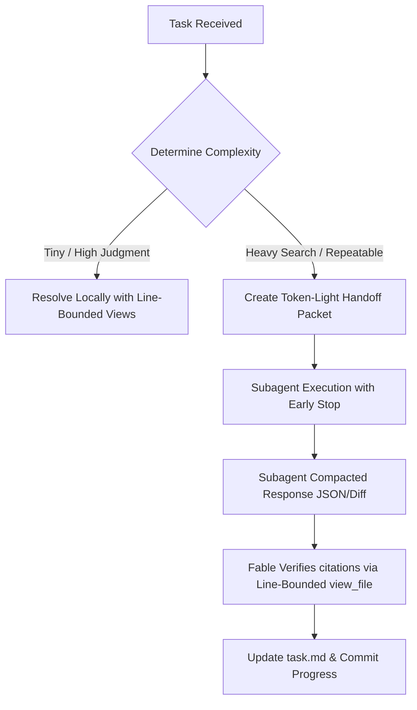

# Lean Fable

Lean Fable is a token-frugal orchestration protocol designed to optimize Claude's context window. It prevents "context bloat" and maximizes **Prompt Caching** hits when delegating tasks to subagents.

Use this skill when orchestrating codebase-heavy, log-heavy, or multi-turn tasks.

---

## 1. Claude Prompt Caching Layout

Claude supports prompt caching for contexts exceeding 1,024 tokens. To maximize cache hits, structure all instructions and agent context deterministically:

1. **Static Top (Cache Target):** Place system instructions, guidelines, static codebase rules, and tool schemas at the very beginning of the prompt.
2. **Stable Middle:** Place stable project context (e.g., architecture overviews, recent file schemas) in the middle.
3. **Dynamic Tail:** Place frequently changing variables (timestamps, file contents under edit, chat history, user queries) at the absolute bottom.
4. **Consistency:** Avoid inserting dynamic headers (like UUIDs, variable timestamps, or random identifiers) inside the static prefix, as this invalidates the entire downstream cache.

---

## 2. Line-Bounded Verification

Reading full files is the single largest contributor to agent context bloat. Fable must vet subagent findings using precise, targeted file views:

* **Strict Prohibition:** Never run `view_file` on entire files or large chunks (>200 lines) unless absolutely necessary for architecture reviews.
* **Line-Bounded Reads:** Use the `StartLine` and `EndLine` parameters in `view_file` to load only the specific lines of code cited by subagents.
* **Granular Edits:** When modifying files, target specific lines with `replace_file_content` or `multi_replace_file_content` chunks rather than rewriting entire files.

---

## 3. Subagent Response Compaction

Subagent prompts must explicitly instruct them to return token-light, high-signal evidence. 

* **Response Formats:** Direct subagents to return results using:
  * **JSON objects** containing only keys, files, and line numbers.
  * **Unified diffs** or short code blocks.
  * **Bulleted lists** of exact locations (avoiding narrative descriptions of the code).
* **Early-Termination Confidence Checks:** Instruct subagents to stop searching, scanning, or grepping as soon as they find a definitive match or hit a specified stop condition.
* **Test Log Reduction:** When running test suites, tell subagents to parse and return only the failing test names and traceback snippets rather than printing full stdout logs.

---

## 4. Proactive Context Compaction & Resets

In long, multi-turn conversations, the chat history itself becomes a major token liability. Fable must actively manage history:

* **Checkpointing**: Maintain progress in `task.md` and `walkthrough.md` files in the workspace.
* **Context Resetting**: When conversation turns exceed 15–20 turns (or estimated context reaches 50k–80k tokens), write out a comprehensive state summary to a scratch file, notify the user, and prompt them to start a new thread using the saved summary. This clears accumulated history tokens.

---

## 5. Decision Flow

